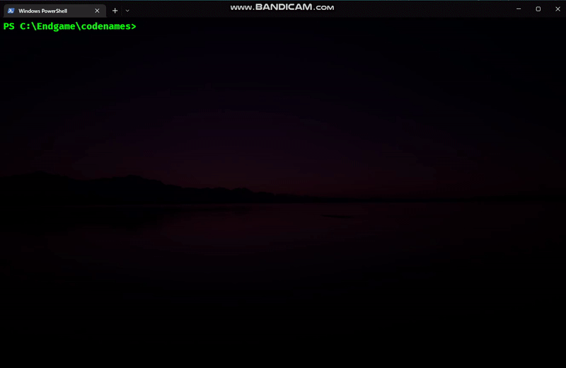
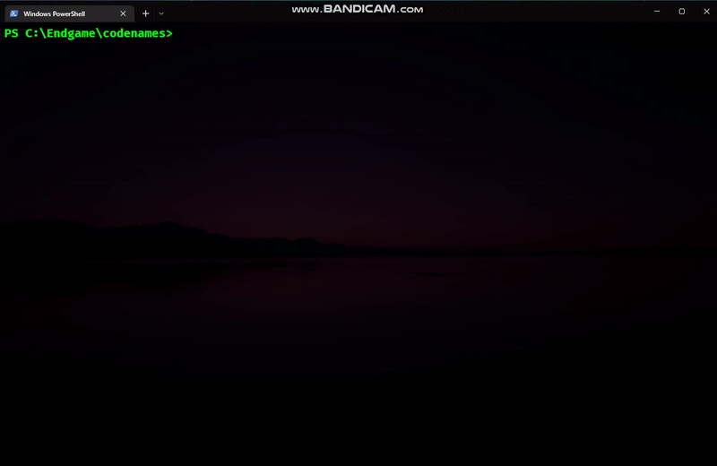
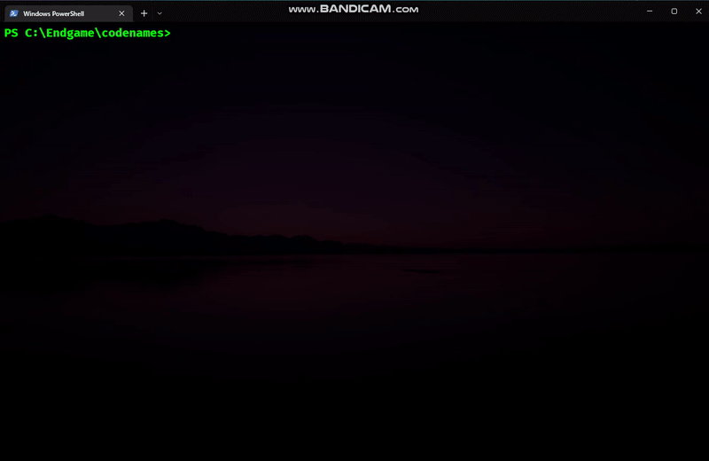

Play Codenames with Glove
=========================

Dataset Link: https://www.kaggle.com/datasets/thanakomsn/glove6b300dtxt
Create a folder named "dataset" and paste the TXT file in it.
First run the convert.py to load the database, then codenames.py to play

This repository implements a simple single-player version of the codenames game
by Vlaada Chvátil.
You can play as the agent or the spymaster, and the Glove word vectors will
take the role of your partner, as you try to find the 8 marked words in as few
rounds as possible.

Implementation
============
Conversion:

___
Playing as Spymaster:

___
Playing as Agent:

How it works
============
The bot decides what words go well together, by comparing their vectors in the GloVe trained on Wikipedia text.
This means that words that often occour in the same articles and sentences are judged to be similar.
In the example about, golden is of course similar to bridge by association with the Golden Gate Bridge.
Other words that were found to be similar were 'dragon', 'triangle', 'duck', 'iron' and 'horn'.

However, in Codenames the task is not merely to find words that describe other words well.
You also need to make sure that 'bad words' are as different as possible from your clue.
To achieve this, the bot tries to find a word that maximizes the similarity gap between the marked words and the bad words.

If you want the bot to be more aggressive in its clues (choosing larger groups), try changing the `agg = .5` value near the top of `codenames.py` to a larger value, such as `.8` or `1.5`. 
